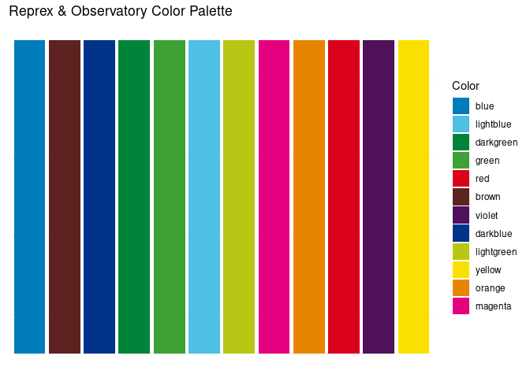

<!-- README.md is generated from README.Rmd. Please edit that file -->

# Reprex & Observatories Brand Identiy

<!-- badges: start -->

[](https://dataobservatory.eu/)

<!-- badges: end -->



``` r
kable(
  data.frame (
  Color = names(reprex_palette()), 
  HEX = as.character(reprex_palette())
 )
)
```

| Color      | HEX      |
|:-----------|:---------|
| blue       | \#007CBB |
| lightblue  | \#4EC0E4 |
| darkgreen  | \#00843A |
| green      | \#3EA135 |
| red        | \#DB001C |
| brown      | \#5C2320 |
| violet     | \#4E115A |
| darkblue   | \#00348A |
| lightgreen | \#BAC615 |
| yellow     | \#FAE000 |
| orange     | \#E88500 |
| magenta    | \#E4007F |

## Installation

If you want to use in the palette in R, for example, in ggplot2, you
need to install the development version of reprextemplates from
[GitHub](https://github.com/) with:

``` r
# install.packages("devtools")
devtools::install_github("dataobservatory-eu/reprextemplates")
```

``` r
library(reprextemplates)
reprex_palette()
#>       blue  lightblue  darkgreen      green        red      brown     violet 
#>  "#007CBB"  "#4EC0E4"  "#00843A"  "#3EA135"  "#DB001C"  "#5C2320"  "#4E115A" 
#>   darkblue lightgreen     yellow     orange    magenta 
#>  "#00348A"  "#BAC615"  "#FAE000"  "#E88500"  "#E4007F"
```

## Code of Conduct

Please note that the reprextemplates project is released with a
[Contributor Code of
Conduct](https://contributor-covenant.org/version/2/1/CODE_OF_CONDUCT.html).
By contributing to this project, you agree to abide by its terms. \#
brand_identity_media
